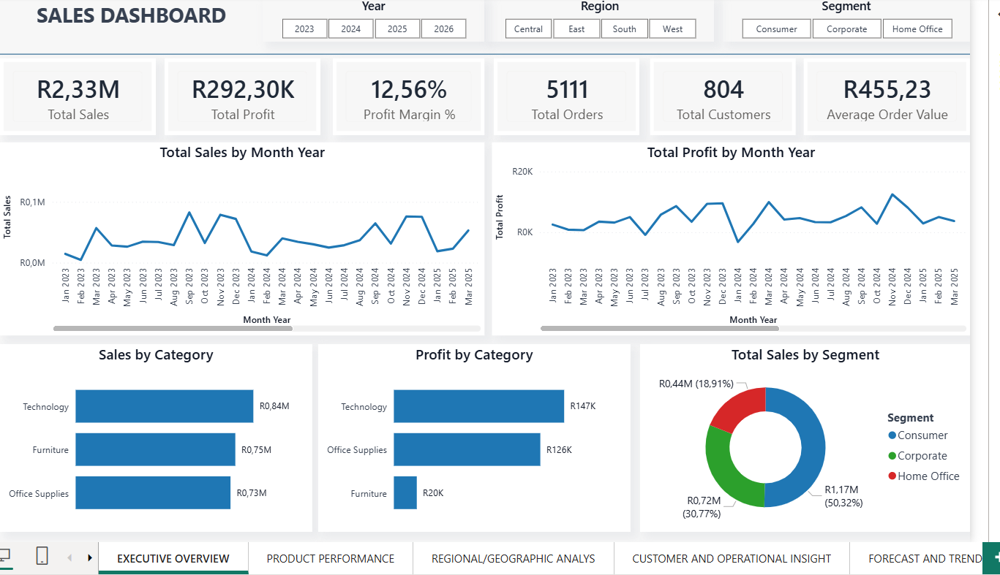
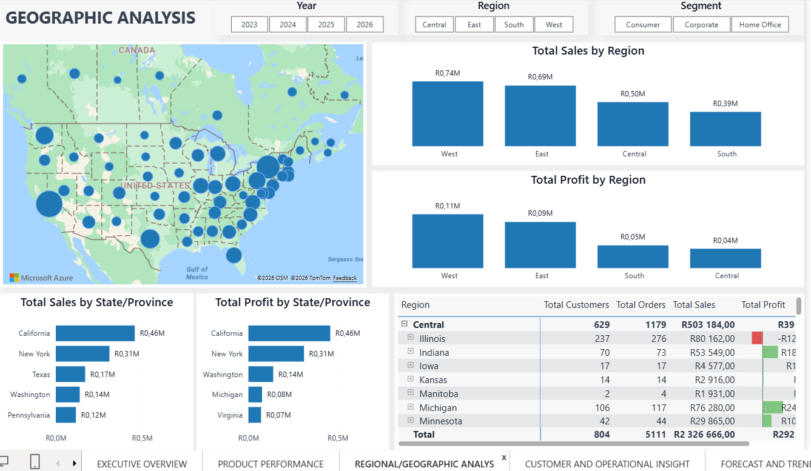
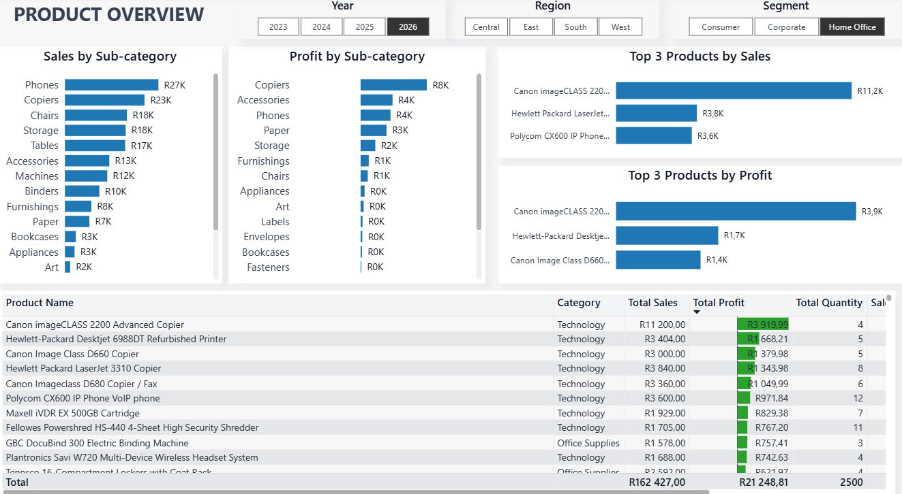
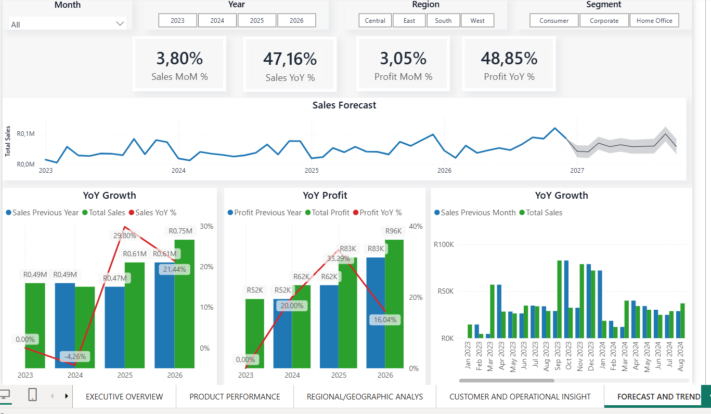

# 📊 Sales Dashboard (Power BI)

## 📌 Overview
This project presents an interactive Power BI dashboard designed to analyze sales performance, profitability, customer behavior, and future trends.

The goal is to provide **clear, data-driven insights** that support better business decision-making.

---

## 🎯 Objectives

- Track overall business performance
- Identify high-performing products and regions
- Analyze customer purchasing behavior
- Monitor profitability and margins
- Forecast future sales trends

---

## 📂 Dataset

- Source: Superstore Dataset (public dataset)
- Contains:
  - Orders
  - Customers
  - Products
  - Sales & Profit metrics

---

## 🧰 Tools & Technologies

- Power BI  
- Power Query (Data Cleaning & Transformation)  
- DAX (Measures & Calculations)

---

## 📊 Key KPIs

- 💰 Total Sales  
- 📈 Total Profit  
- 📊 Profit Margin %  
- 🛒 Average Order Value  
- 👥 Customer Segmentation  

---

## 📈 Dashboard Features

### 🔹 Sales Performance
- Sales trends over time
- Monthly and yearly comparisons
- Regional performance breakdown

### 🔹 Profitability Analysis
- Profit by category and sub-category
- Loss-making products identification
- Margin analysis

### 🔹 Customer Insights
- High vs low value customers
- Customer segmentation
- Purchase behavior trends

### 🔹 Forecasting
- Time series forecasting
- Future sales predictions based on historical trends

---

## 🖼️ Dashboard Preview

### 📊 Overview

### 🌍 Geographic Analysis

### 📦 Product Analysis

### 🔮 Forecasting

